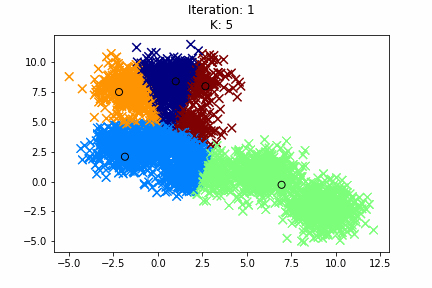

# kmeans-animation
python script to help make quick visual representation of k-means clustering on some data

Before running, execute
```bash
pip install -r requirements.txt
```

To simply create an animation, create an instance of `KmeansAnimate2D` class
```python
points = np.random.rand(50, 2) # our data, must be of nxd shape & an numpy-array
kmeans = KmeansAnimate2D(k=3, data=points)
kmeans.animate() # shows the animation in another window (won't work in jupyter notebooks)
kmeans.saveGIF("kmeans-animation") # to save the animation as kmeans-animation.gif 

# kmeans.animate_jupyter_nb() # to show animation in a jupyter notebook
```

### Example 


